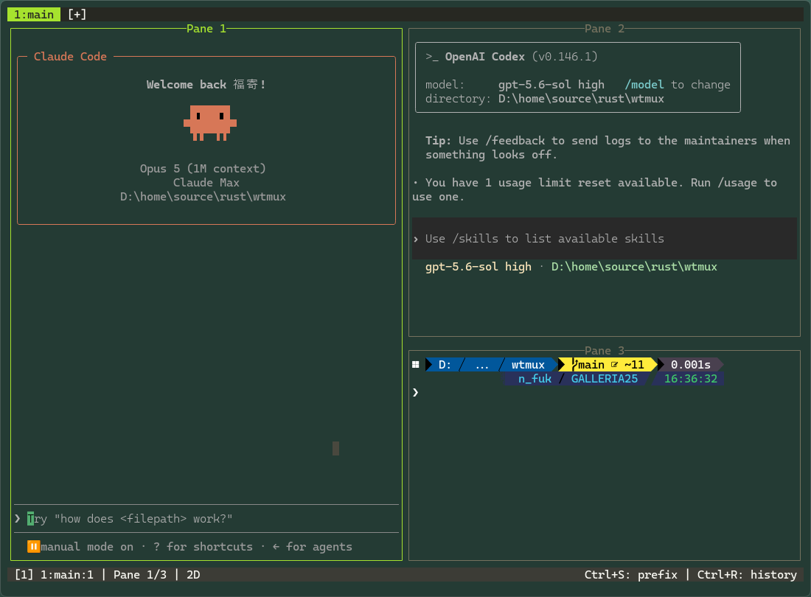
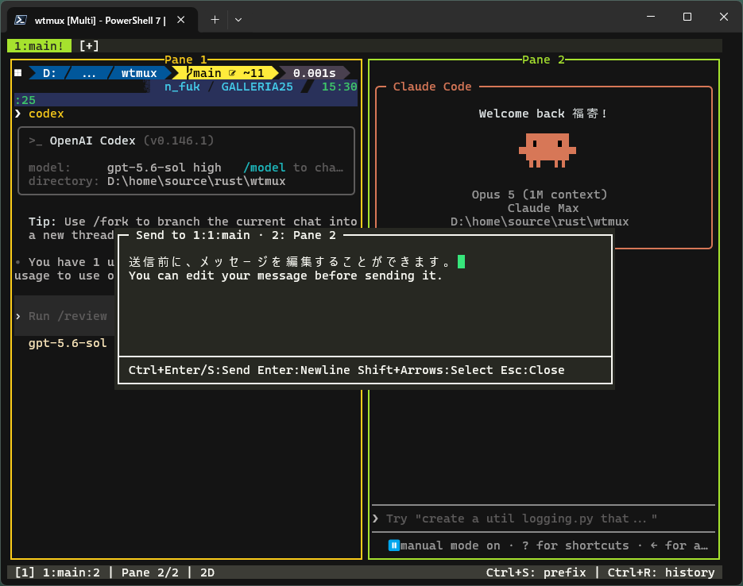

# wtmux

Windows / macOS / Linux 対応のtmuxライクなターミナルマルチプレクサ（Rust製）

[](https://opensource.org/licenses/MIT)
[](https://github.com/fukuyori/wtmux)
[](https://github.com/fukuyori/wtmux/releases)

[](https://apps.microsoft.com/detail/9PKHJXB67R2N)

[English README](README.md)

## 3.0.0 の主な変更

- **キーバインドを設定ファイルで変更可能に** — プレフィックス配下の全キーを tmux の `bind-key` と同じように `config.toml` で再割り当て・解除できるようになりました。プレフィックス不要のキー（tmux の `bind-key -n`）も `[bind_root]` で設定できます。「[キーバインドのカスタマイズ](#キーバインドのカスタマイズ)」を参照。
- **`wtmux list-keys`**（省略形 `lsk`）— 設定適用後の全バインドを `[bind]` と同じ記法で一覧表示します。
- **プレフィックス配下で修飾キーを判定するようになりました** — `Prefix, C-x` がより適切なバインドのない場合を除き `x` のバインドを発動しなくなります。Ctrl を押しっぱなしにする操作（`C-b C-n`）は従来どおり動作します。
- 2.3.4 より: **ペインの枠とタイトルを見やすく改善** — ペインタイトルを枠線と同じ色で描くようにし、非フォーカスの枠色を全8テーマで明るくしました。
- 2.3.0〜2.3.3 より: **エージェント向け機能** — `Prefix + m` のメッセージコンポーザ（複数行メッセージをペインに送信、IME対応）と、全ペインの WORKING / BLOCKED / DONE / IDLE 状態を Nerd Font スピナー付きで監視する `wtmux agents` CLI（`Prefix + g` ダッシュボードでも表示）。

## 特徴

- **tmux互換キーバインド** - デフォルトはおなじみの `Ctrl+B` プレフィックスコマンド。ショートカットは設定で変更可能
- **複数タブ（ウィンドウ）** - タブの作成、切り替え、名前変更、管理
- **ペイン分割** - 水平・垂直分割、リサイズ対応
- **ペインズーム** - 任意のペインを全画面表示
- **レイアウトプリセット** - 5種類のレイアウト（横均等、縦均等、メイン横、メイン縦、タイル）
- **コピーモード** - vimライクなスクロールバック操作とテキスト選択
- **検索機能** - スクロールバック内をハイライト検索
- **カラースキーム** - 8種類の組み込みテーマ（default、solarized、monokai、nord、dracula、gruvbox、tokyo-night）
- **設定ファイル** - TOML形式の設定ファイル対応
- **クロスプラットフォームPTYバックエンド** - WindowsはConPTY、macOS / LinuxはPOSIX pty（openpty）
- **複数シェル対応** - Windowsはcmd.exe、PowerShell、PowerShell 7、WSL。macOS / Linuxは `$SHELL`（bash、zsh、fishなど）
- **エンコーディング対応** - UTF-8とShift-JIS（CP932、Windowsのみ）
- **マウスパススルー** - TUIアプリにマウスイベントを転送（Shiftでwtmuxの選択を使用）
- **Kitty キーボードプロトコル** - ペイン内アプリが *disambiguate escape codes* / *report event types* 拡張（`CSI u`）を利用可能。neovim や WSL/ssh 内の helix・fish などが Ctrl+I と Tab、Shift+Enter と Enter を区別でき、キーリリースイベントも受け取れます
- **win32-input-mode パススルー** - Win32 API でコンソールを読むアプリにも完全なキーレコード（Shift+Enter、Ctrl+Enter、キーリリース）を転送（DECSET 9001）。Windows Terminal 直下と同じ入力忠実度
- **OSC 52 クリップボード & フォーカスイベント** - ペイン内アプリ（ssh/WSL 先を含む）からホストのクリップボードへコピー可能。フォーカス変化は `CSI I`/`CSI O` で通知（DECSET 1004、ペイン切り替えにも反応）
- **拡張下線** - 波線・二重線・点線・破線の下線スタイルと下線色（SGR `4:x` / `58`）に対応。nvim/helix の LSP 診断が意図どおり表示されます
- **OSC 8 ハイパーリンク** - ペイン内アプリのリンク（`ls --hyperlink`、delta、starship、コンパイラ診断など）がホスト端末で Ctrl+クリック可能なまま維持されます

## スクリーンショット





## 動作要件

- **Windows**: Windows 10 バージョン1809以降（ConPTYサポートが必要）
- **macOS / Linux**: 一般的なターミナル（iTerm2、Ghostty、WezTerm、kitty、GNOME Terminal など）— wtmux は標準の POSIX pty を使ってその中で動作します
- Rust 1.70以降（ソースからビルドする場合）

## インストール

### 方法1: リリース版をダウンロード

[Releases](https://github.com/fukuyori/wtmux/releases) ページからダウンロード：

**Windows**

- **Microsoft Store** — [wtmuxをダウンロード](https://apps.microsoft.com/detail/9PKHJXB67R2N)
- **インストーラー** (`wtmux-x.x.x-setup.exe`) - 一般ユーザー向け推奨
- **ポータブル版** (`wtmux-x.x.x-portable-x64.zip`) - インストール不要、展開して実行するだけ
- **MSI** (`wtmux-x.x.x-x64.msi`) - 企業展開向け

**macOS**

- **インストーラーパッケージ** (`wtmux-x.x.x.pkg`) - 署名・公証済み。`/usr/local/bin/wtmux` にインストールされます

**Linux**

- **.deb / .rpm パッケージ** - `scripts/build-linux-packages.sh` でビルド（下記参照）
- ソースからビルド（方法2を参照）

### 方法2: ソースからビルド

```bash
git clone https://github.com/fukuyori/wtmux.git
cd wtmux
cargo build --release

# Windows: 任意の場所にコピー
copy target\release\wtmux.exe C:\your\bin\path\

# macOS / Linux: PATH の通ったディレクトリにコピー
cp target/release/wtmux /usr/local/bin/
```

### インストーラーのビルド（Windows）

```powershell
# ポータブル版（ZIP）
.\scripts\build-portable.ps1

# Inno Setup使用（エンドユーザー向け推奨）
# ダウンロード: https://jrsoftware.org/isinfo.php
.\scripts\build-inno-installer.ps1

# WiX Toolset使用（企業展開向け）
# ダウンロード: https://wixtoolset.org/releases/
# WiX Toolset v7 では、スクリプトが OSMF EULA を自動受諾してからビルドします。
.\scripts\build-installer.ps1

# MSIXパッケージ（Windows 10/11向け）
# Windows 10 SDKが必要
.\scripts\build-msix.ps1              # 未署名（開発者モードが必要）
.\scripts\build-msix.ps1 -Sign        # 自己署名（テスト用）

# assets/wtmux-icon.svg を編集した後にアイコン資産を再生成
# 生成された .ico は wtmux.exe に埋め込まれ、各インストーラーでも再利用されます。
.\scripts\generate-icons.ps1
```

### macOSインストーラーのビルド

`scripts/sign-and-notarize-macos.sh` は `target/release/wtmux` から
署名・公証済みの `.pkg` をビルドします（Developer ID証明書と
notarytoolのキーチェーンプロファイルが必要）：

```bash
cargo build --release
./scripts/sign-and-notarize-macos.sh
```

### Linuxパッケージのビルド

`scripts/build-linux-packages.sh` は [`cargo-deb`](https://crates.io/crates/cargo-deb) と
[`cargo-generate-rpm`](https://crates.io/crates/cargo-generate-rpm) を使い、
`target/release/wtmux` から `.deb` と `.rpm` パッケージをビルドします
（パッケージメタデータは `Cargo.toml` に定義）：

```bash
cargo install cargo-deb cargo-generate-rpm  # 初回のみ
./scripts/build-linux-packages.sh           # 両方ビルド
./scripts/build-linux-packages.sh --deb     # .debのみ
./scripts/build-linux-packages.sh --rpm     # .rpmのみ
```

出力先は `installer/output/` です。

## 使い方

```bash
# デフォルト: マルチペインモード
wtmux

# PowerShell 7 + UTF-8
wtmux -7 -u

# WSL
wtmux -w

# カスタムシェル（例: macOS / Linux で zsh）
wtmux -s zsh

# シンプルモード（単一ペイン）
wtmux -1

# ヘルプ表示
wtmux --help
```

### コマンドラインオプション

| オプション | 説明 |
|--------|-------------|
| `-1, --simple` | シンプルモード（単一ペイン） |
| `-c, --cmd` | コマンドプロンプトを使用 *（Windowsのみ）* |
| `-p, --powershell` | Windows PowerShellを使用 *（Windowsのみ）* |
| `-7, --pwsh` | PowerShell 7を使用 *（Windowsのみ）* |
| `-w, --wsl` | WSLを使用 *（Windowsのみ）* |
| `-s, --shell <CMD>` | カスタムシェルコマンド |
| `--sjis` | Shift-JISエンコーディング（デフォルト: UTF-8）*（Windowsのみ）* |
| `-P, --cwd-prompt-hook <on\|off>` | シェルの cwd 追跡用プロンプトフックを設定 |
| `--no-cwd-prompt-hook` | シェルの cwd 追跡用プロンプトフックを無効化 |
| `-v, --version` | バージョン表示 |
| `-h, --help` | ヘルプ表示 |
| `list-keys`（`lsk`） | 設定適用後のキーバインド一覧を表示 |

Windows専用オプションは macOS / Linux では非表示になります。macOS / Linux の
デフォルトシェルは `$SHELL`（未設定時は `/bin/sh`）で、`-s` オプションまたは
設定ファイルの `shell` キーで変更できます。

## キーバインド

プレフィックス付きコマンドは、デフォルトでは `Ctrl+B` を使用します（tmuxと同じ）。
プレフィックスキーは `prefix_key` で変更できます。以下の表はデフォルト設定のキーで、
いずれも設定ファイルで変更・解除できます（「[キーバインドのカスタマイズ](#キーバインドのカスタマイズ)」参照）。

### ウィンドウ（タブ）

| キー | 動作 |
|-----|--------|
| `Ctrl+B, c` | 新規ウィンドウ作成 |
| タブバーの `[+]` をクリック | 新規ウィンドウ作成 |
| `Ctrl+B, &` | 現在のウィンドウを閉じる |
| `Ctrl+B, n` | 次のウィンドウ |
| `Ctrl+B, p` | 前のウィンドウ |
| `Ctrl+B, l` | 最後のウィンドウに切り替え |
| `Ctrl+B, w` | ウィンドウ一覧を表示 |
| `Ctrl+B, 0-9` | 番号でウィンドウを選択 |
| `Ctrl+B, ,` | ウィンドウ名を変更 |

ウィンドウ一覧には各ウィンドウのペイン数と tmux 形式のフラグ
（`*` 現在、`-` 直前）が表示され、下部に選択中ウィンドウのライブ
プレビューが表示されます。`↑`/`↓` または `j`/`k` で選択を移動、
`1`-`9` で番号ジャンプ、`Enter` で切り替え、`x` で選択中の項目を
削除（`y` で確定）、`Esc` または `q` で一覧を閉じます。ウィンドウは
ツリー展開できます: `→`/`l` でペインを子行として表示、`←`/`h` で
折りたたみ。ペイン行を選ぶとそのペインだけがプレビューされ、
`Enter` でそのペインにフォーカスした状態で切り替わります。マウスも
使えます: ホイールで選択を移動、行をクリックで切り替え、ポップ
アップの外側をクリックすると閉じます。

### ペイン

| キー | 動作 |
|-----|--------|
| `Ctrl+B, "` | 水平分割（上下） |
| `Ctrl+B, %` | 垂直分割（左右） |
| `Ctrl+B, x` | 現在のペインを閉じる |
| `Ctrl+B, o` | 次のペイン |
| `Ctrl+B, ;` | 前のペイン |
| `Ctrl+B, ←↑↓→` | 指定方向のペインにフォーカス移動 |
| `Ctrl+B, Ctrl+←↑↓→` | ペインサイズ変更 |
| `Ctrl+B, z` | ペインズーム切り替え |
| `Ctrl+B, Space` | レイアウトプリセット切り替え |
| `Ctrl+B, q` | ペイン番号表示（その後0-9で選択） |
| `Ctrl+B, {` | 前のペインと入れ替え |
| `Ctrl+B, }` | 次のペインと入れ替え |
| `Ctrl+B, .` | ペイン名を変更（空にするとデフォルトに戻る） |

### コピーモード

| キー | 動作 |
|-----|--------|
| `Ctrl+B, [` | コピーモードに入る |
| `Ctrl+B, /` | 検索モードに入る |

コピーモード中：

| キー | 動作 |
|-----|--------|
| `h/j/k/l` または矢印キー | カーソル移動 |
| `0` / `$` | 行頭 / 行末 |
| `g` / `G` | バッファ先頭 / 末尾 |
| `Ctrl+U` / `Ctrl+D` | 半ページ上 / 下 |
| `Ctrl+B` / `Ctrl+F` | 1ページ上 / 下 |
| `Space` または `v` | 選択開始/切り替え |
| `Enter` または `y` | 選択範囲をコピーして終了 |
| `/` | 前方検索 |
| `?` | 後方検索 |
| `n` / `N` | 次 / 前のマッチ |
| `q` または `Esc` | コピーモード終了 |

### その他

| キー | 動作 |
|-----|--------|
| `Ctrl+B, :` | コマンドプロンプト（tmuxスタイルのコマンド入力、下記参照） |
| `Ctrl+B, t` | テーマ選択 |
| テーマ選択中の `Esc` | テーマ選択をキャンセル |
| `Ctrl+B, m` | メッセージコンポーザー（複数行エディタ、下記参照） |
| `Ctrl+B, r` | カーソル形状をリセット |
| `Ctrl+B, Shift+P` | フォーカスペインの出力ログを切り替え（`[LOG]`） |
| `Ctrl+B, b` | アプリケーションにCtrl+Bを送信 |
| `Esc` | プレフィックスモードをキャンセル |

### メッセージコンポーザー

`Ctrl+B, m` で、フォーカス中のペインのアプリケーションへ送るメッセージを
作成する浮動の複数行エディタが開きます（IME対応。Claude Code などの
AIエージェント宛に便利です）。エージェントダッシュボードの `m`、および
`compose-message` コマンドからも開けます。

| キー | 動作 |
|-----|--------|
| `Ctrl+Enter`（または `Ctrl+S`） | メッセージを送信 |
| `Enter` | 改行を挿入 |
| `Esc` | 閉じる（未送信の下書きは `Ctrl+P` で呼び出せます） |
| `Shift+矢印` / `Shift+Home` / `Shift+End` | 選択範囲を拡張 |
| `Ctrl+A` | 全選択 |
| `Ctrl+C` / `Ctrl+X` | 選択範囲をコピー / カット |
| `Ctrl+V` | クリップボードから貼り付け |
| `Ctrl+Z` / `Ctrl+Y` | 元に戻す / やり直し |
| `Ctrl+Home` / `Ctrl+End` | メッセージの先頭 / 末尾へ移動 |
| `Ctrl+U` | メッセージを消去 |
| `Ctrl+P` / `Ctrl+N` | 送信済みメッセージを新旧に呼び出し |
| `Tab` | スペース4個を挿入 |

マウスも使えます。クリックでカーソル移動、ドラッグで選択、ホイールで
スクロール、右端・下端の枠（または右下角）のドラッグでポップアップを
リサイズできます（サイズは wtmux 終了まで保持）。フッターには行数と
文字数のカウンターが表示されます。

### コマンドプロンプト

`Ctrl+B, :` でステータスバー上にtmuxスタイルのコマンドプロンプトが開きます。
対応コマンド（括弧内はtmux互換の省略形）：

| コマンド | 動作 |
|---------|------|
| `split-window [-h]`（`splitw`） | ペイン分割。`-h` で左右分割 |
| `new-window`（`neww`） | ウィンドウ作成 |
| `kill-pane`（`killp`）/ `kill-window`（`killw`） | ペイン / ウィンドウを閉じる |
| `next-window` / `previous-window` / `last-window`（`next` / `prev` / `last`） | ウィンドウ切り替え |
| `select-window -t <n>`（`selectw`） | 番号でウィンドウ選択 |
| `rename-window <名前>`（`renamew`） | ウィンドウ名変更 |
| `rename-pane [名前]`（`renamep`） | ペイン名変更（名前省略でデフォルトに戻る） |
| `select-layout <even-horizontal\|even-vertical\|main-horizontal\|main-vertical\|tiled>`（`selectl`） | レイアウト適用 |
| `resize-pane -Z` | ペインズーム切り替え |
| `set synchronize-panes [on\|off]` | 入力ブロードキャスト |
| `pipe-pane` | ペイン出力ログの切り替え |
| `display-popup [コマンド]`（`popup`） | フローティングポップアップを開く |

実行結果やエラーはステータスバーに数秒間表示されます。

### ポップアップ（display-popup）

`:display-popup [コマンド]`（または任意のシェルから `wtmux display-popup [コマンド...]`）で、
画面中央（端末の60%）にフローティングペインを開いてコマンド（省略時はデフォルトシェル）を
実行します。入力はすべてポップアップに送られ、コマンドの終了で自動的に閉じます。
固まった場合は `Ctrl+B, x` で強制クローズできます。コマンドは直接spawnされるため、
シェル組み込みコマンドは明示的にシェル経由で指定してください
（例: Windowsは `display-popup cmd /c dir`、macOS / Linuxは `display-popup sh -c "ls | head"`）。

### 履歴機能

wtmuxには、シェルの履歴機能とは別に、独自のコマンド履歴機能が搭載されています。入力したコマンドを記録し、複雑なコマンドを何度も入力する必要がなくなります。
履歴検索のショートカットはデフォルトでは `Ctrl+R` で、`keybindings.history_selector` で変更できます。

| キー | 動作 |
|-----|--------|
| `Ctrl+R` | 履歴検索表示 |
| `Enter` | 選択コマンドを実行（現在の入力を置換） |
| `Shift+Enter` | `&&` で追加（前コマンド成功時に実行） |
| `Ctrl+Enter` | `&` で追加（バックグラウンド/並列実行） |

詳細は: https://qiita.com/spumoni/items/7d43ed7e579d99cfda3e

## 設定

wtmuxは設定ディレクトリ内の `config.toml` から設定を読み込みます：

| OS | 場所 |
|----|------|
| Windows | `%LOCALAPPDATA%\wtmux\config.toml`（例: `C:\Users\ユーザー名\AppData\Local\wtmux\config.toml`） |
| macOS / Linux | `$XDG_CONFIG_HOME/wtmux/config.toml`（`XDG_CONFIG_HOME` 未設定時は `~/.config/wtmux/config.toml`） |

どちらの場所も決定できない場合は `~/.wtmux/config.toml` にフォールバックします。
コマンド履歴・ペイン出力ログ・VTトレースも同じディレクトリに保存されます。

```toml
# デフォルトシェル（省略可）
# Windows: "cmd", "powershell", "pwsh", "wsl", またはフルパス
# macOS / Linux: コマンド名またはフルパス（デフォルト: $SHELL、未設定時は /bin/sh）
# shell = "pwsh.exe"

# エンコーディングのコードページ（省略可、Windowsのみ）
# codepage = 65001  # UTF-8
# codepage = 932    # Shift-JIS

# プレフィックスキー（デフォルト: "C-b" = Ctrl+B）
# prefix_key = "C-a"  # Ctrl+Aに変更

# cmd.exe / PowerShell にプロンプトフックを入れて pane cwd の変化を通知します。
# プロンプトへの副作用を避けるため標準では無効です。
# cwd_prompt_hook = false

# 既定バインドの解除（tmux: unbind-key）
# 配列なので、以下の [セクション] より前に置く必要があります
# unbind = ["d", "P"]

# カラースキーム
# 利用可能: default, solarized-dark, solarized-light, monokai, nord, dracula, gruvbox-dark, tokyo-night
color_scheme = "tokyo-night"

# プレフィックス外のグローバルキーバインド（旧方式・下の [bind_root] を推奨）
[keybindings]
# history_selector = "C-r"      # "Ctrl+R" 形式でも指定可能
# scrollback_up = "S-PageUp"
# scrollback_down = "S-PageDown"
# scrollback_top = "S-Home"
# scrollback_bottom = "S-End"
# selection_left = "S-Left"
# selection_right = "S-Right"
# selection_up = "S-Up"
# selection_down = "S-Down"
# copy_selection = "C-S-c"      # "Ctrl+Shift+C" 形式でも指定可能

# プレフィックス配下のキーバインド（tmux: bind-key）
[bind]
# "M-4" = "select-layout main-vertical"
# "M-5" = "select-layout tiled"
# "C-o" = "swap-pane -D"
# "z"   = ""                    # 空文字で解除

# プレフィックス不要のキーバインド（tmux: bind-key -n）
# スクロールバック・選択・コピーのキーはこちらで設定するのが推奨です
[bind_root]
# "S-PageUp" = "scroll-up"
# "C-S-c"    = "copy-selection"
# "C-M-t"    = "select-layout tiled"

# タブバー設定
[tab_bar]
visible = true

# ステータスバー設定
[status_bar]
visible = true
show_time = true

# ペイン境界線設定
[pane]
border_style = "single"  # single, double, rounded, none

# カーソル設定
[cursor]
shape = "block"          # block, underline, bar
blink = true

# スクロールバックバッファ
[scrollback]
lines = 10000

# エージェント状態フック（下の「AIエージェント連携」を参照）
[hooks]
# on_agent_blocked = "powershell -NoProfile -Command \"...通知...\""
# on_agent_done = ""
```

`[keybindings]` セクションは、履歴検索（デフォルト `Ctrl+R`）、スクロールバック移動、
キーボード選択、選択コピーのショートカットを変更する旧方式です。互換のため残っていますが、
同じ機能はコマンド（`scroll-up` / `extend-selection` / `copy-selection` /
`history-selector` など）としてもバインドできるので、キーを自由に選べて解除もできる
`[bind_root]` での設定を推奨します（競合時は `[bind_root]` が優先されます）。

### キーバインドのカスタマイズ

`[bind]` / `[bind_root]` / `unbind` で、tmux の `bind-key` と同じようにキーへ
コマンドを割り当てられます。既定のキーバインドはすべて上書き・解除が可能です。

```toml
unbind = ["d"]                 # 既定の Ctrl+B, d を解除（配列は [セクション] より前に）

[bind]                         # プレフィックスの後に押すキー
"M-1" = "select-layout even-horizontal"
"M-4" = "select-layout main-vertical"
"M-5" = "select-layout tiled"
"|"   = "split-window -h"
"C-o" = "swap-pane -D"
"z"   = ""                     # 空文字で解除（unbind と同じ）

[bind_root]                    # プレフィックスなしで押すキー
"C-M-Left"  = "select-pane -L"
"C-M-Right" = "select-pane -R"
```

**キー名**: 1文字（`c`、`%`、`4`）、または `Space` `Enter` `Esc` `Tab`
`Backspace` `Delete` `Insert` `Up` `Down` `Left` `Right` `Home` `End`
`PageUp` `PageDown` `F1`〜`F12`。修飾子は `C-`（Ctrl）、`M-`（Alt）、
`S-`（Shift）を前置します（`Ctrl+` `Alt+` `Shift+` 形式も可）。
文字キーは大文字・小文字を区別するため、`P` と `p` は別のキーです。

**コマンド**:

| 分類 | コマンド |
|------|---------|
| ウィンドウ | `new-window` / `kill-window` / `next-window` / `previous-window` / `last-window` / `select-window -t <n>` / `rename-window` / `choose-window` |
| ペイン | `split-window [-h]` / `kill-pane` / `next-pane` / `previous-pane` / `select-pane -L\|-R\|-U\|-D` / `swap-pane -U\|-D` / `display-panes` / `rename-pane` |
| サイズ | `resize-pane -Z`（ズーム） / `resize-pane -L\|-R\|-U\|-D` / `resize-pane +` / `resize-pane -` |
| レイアウト | `next-layout` / `select-layout <even-horizontal\|even-vertical\|main-horizontal\|main-vertical\|tiled>` |
| モード | `copy-mode` / `search` / `command-prompt` / `choose-theme` / `agent-dashboard` / `compose-message` |
| ターミナル操作 | `scroll-up [n]` / `scroll-down [n]` / `scroll-top` / `scroll-bottom` / `extend-selection -L\|-R\|-U\|-D` / `copy-selection` / `history-selector` |
| その他 | `set synchronize-panes` / `pipe-pane` / `paste-buffer` / `send-prefix` / `detach-client` / `next-attention` / `reset-cursor` / `none` |

**注意点**:

- `[bind_root]` のキーはシェルに渡る前に横取りされ、`[keybindings]` より優先されます
- 設定ミスがあってもそのエントリだけを飛ばし、起動時に stderr へ理由を表示します
- `wtmux list-keys`（省略形 `lsk`）で、設定適用後の全バインドを `[bind]` と同じ記法で確認できます

```
$ wtmux list-keys
bind      Space        next-layout
bind      Alt+4        select-layout main-vertical
bind      c            new-window
bind_root Ctrl+Alt+Left select-pane -L
```

### フォント設定

```toml
[font]
# フォントファミリー（空欄でホスト端末から継承）
# family = "CaskaydiaCove Nerd Font"

# フォントサイズ（ポイント。0でホスト端末から継承）
# size = 12

# SGR 1 (Bold) を抑制 — Powerline/Nerd Font グリフがずれる場合は true に設定
# 詳細は「トラブルシューティング」セクションを参照
# suppress_bold = false
```

### 利用可能なカラースキーム

- `default` - デフォルトのターミナル色
- `solarized` - Solarized Dark
- `monokai` - Monokai Pro
- `nord` - Nord
- `dracula` - Dracula
- `gruvbox` - Gruvbox Dark
- `tokyo-night` - Tokyo Night

## AIエージェント連携

wtmuxは全ペインを監視し、herdrスタイルで WORKING / BLOCKED / DONE / IDLE に
分類します（`Prefix + g` でエージェントダッシュボードを表示。WORKING中の
ペインは Nerd Font の円スライススピナーがアニメーションします）。
`wtmux agents` を任意のペインで実行すると同じ一覧が毎秒4回更新され続けます
（Ctrl+Cで終了、`--once` で1回だけ表示）。空きペインや `display-popup` で
流しておけば常時モニタになります。この上に、ペインでAIコーディング
エージェントを走らせるための3つの機能があります。

### エージェント状態フック

ペインの状態が変化した瞬間にコマンドを実行できます。例えば、バックグラウンドの
エージェントが許可待ちでブロックしたらWindowsトースト通知を出す：

```toml
# Windows: %LOCALAPPDATA%\wtmux\config.toml
# macOS / Linux: ~/.config/wtmux/config.toml
[hooks]
on_agent_blocked = 'powershell -NoProfile -Command "New-BurntToastNotification -Text \"wtmux\", \"$env:WTMUX_HOOK_TITLE が入力待ちです\""'
# macOSで通知する場合:
# on_agent_blocked = 'osascript -e "display notification \"$WTMUX_HOOK_TITLE が入力待ちです\" with title \"wtmux\""'
# Linuxで通知する場合:
# on_agent_blocked = 'notify-send wtmux "$WTMUX_HOOK_TITLE が入力待ちです"'
# on_agent_working / on_agent_done / on_agent_idle も利用可能
```

フックはデタッチ実行され（Windowsは `cmd /C`、それ以外は `sh -c`）、
遷移コンテキストは環境変数で渡されます: `WTMUX_HOOK_STATE`、
`WTMUX_HOOK_PREV_STATE`、`WTMUX_HOOK_PANE`（`<ウィンドウ>.<ペイン>`）、
`WTMUX_HOOK_WINDOW`、`WTMUX_HOOK_TITLE`。

### 状態の直接報告（`wtmux report-state`）

ペインの状態は通常、出力のヒューリスティクスから推定されますが、ペイン内で
動くツールが確定情報として直接報告することもできます：

```bash
wtmux report-state blocked     # 呼び出し元ペイン（WTMUX_PID / WTMUX_PANE 経由）
wtmux report-state -t 1.2 done # <ウィンドウ>.<ペイン> を明示指定
```

フック機構を持つエージェントCLIとの相性が良く、Claude Codeでは特にこの設定を
推奨します。Claude Codeは入力待ちの間もスピナーやステータス行を再描画し続ける
ため、出力静止ベースのヒューリスティクスではWORKINGのまま張り付きがちですが、
hooksを使うと許可待ち・入力待ちになった瞬間にBLOCKEDへ切り替わります。
`~/.claude/settings.json` に追加：

```json
{
  "hooks": {
    "UserPromptSubmit": [{ "hooks": [{ "type": "command", "command": "wtmux report-state working 2>/dev/null || true" }] }],
    "Notification":     [{ "hooks": [{ "type": "command", "command": "wtmux report-state blocked 2>/dev/null || true" }] }],
    "Stop":             [{ "hooks": [{ "type": "command", "command": "wtmux report-state done 2>/dev/null || true" }] }]
  }
}
```

`UserPromptSubmit` = プロンプト送信でWORKING、`Notification` = 許可・入力待ちで
BLOCKED、`Stop` = 応答完了でDONE。`2>/dev/null || true` を付けておくと、wtmux外で
Claude Codeを使うときにフックが黙って無視されます。

報告された状態はヒューリスティクスより優先され（新しい出力が来るまで）、
ダッシュボード・ステータスバー・注意フラグに反映され、`[hooks]` コマンドも
発火します。

### 実行中インスタンスのスクリプト操作（`send-keys` / `capture-pane`）

外部ツール — オーケストレータ、スクリプト、別のAIエージェント — から
実行中のwtmuxを操作できます：

```bash
# ウィンドウ1のペイン2にコマンドを入力して実行
wtmux send-keys -t 1.2 "cargo test" Enter

# そのペインの表示内容を取得（-S - でスクロールバック全体も）
wtmux capture-pane -p -t 1.2
wtmux capture-pane -p -t 1.2 -S -

# 実行中インスタンスにポップアップを開く
wtmux display-popup "cmd /c dir"
```

`send-keys` はtmuxのキー名（`Enter`、`Escape`、`Tab`、`Space`、`BSpace`、
`Up`/`Down`/`Left`/`Right`、`Home`、`End`、`PageUp`、`PageDown`、`C-x`、`M-x`）を
解釈し、それ以外はそのまま送信します。`-t` 省略時は呼び出し元ペイン
（`WTMUX_PANE` 経由）またはフォーカスペインが対象です。wtmuxが1つだけ動いている場合は
インスタンスを自動選択、複数ある場合は `--pid <pid>` を指定してください
（`wtmux list-clients` で確認できます）。`report-state` と組み合わせると、
wtmuxの上にclaude-squad型のエージェントオーケストレーションを構築できます。

### ペイン出力ログ（tmux `pipe-pane` 相当）

`Prefix + Shift+P` でフォーカスペインの生出力ストリームのログを
設定ディレクトリ（Windowsは `%LOCALAPPDATA%\wtmux`、macOS / Linuxは
`~/.config/wtmux`）配下の
`logs/wtmux-<pid>-<ウィンドウ>.<ペイン>-<epoch>.log` に記録します。記録中はステータスバーに `[LOG]` が表示されます。エージェントの
セッションの監査やリプレイに便利です。ログにはエスケープシーケンスを含む
生バイトが記録されます（`sed -r 's/\x1b\[[0-9;]*[a-zA-Z]//g'` などで除去可能）。

## シェルからwtmuxを検出する

wtmuxは子プロセスが検出できる環境変数を設定します：

```batch
REM cmd.exe
if defined WTMUX echo wtmux内で実行中
```

```powershell
# PowerShell
if ($env:WTMUX) { "wtmux内で実行中" }
```

```bash
# bash / zsh（macOS / Linux / WSL）
[ -n "$WTMUX" ] && echo "wtmux内で実行中"
```

| 変数 | 意味 |
|------|------|
| `WTMUX` | wtmux内で実行中なら `1` |
| `WTMUX_VERSION` | wtmuxのバージョン |
| `WTMUX_PID` | wtmuxインスタンスのプロセスID（`wtmux report-state` の宛先） |
| `WTMUX_PANE` | プロセスが動いているペインの `<ウィンドウ>.<ペイン>` ID |

## マウスサポート

wtmuxは包括的なマウスサポートを提供しています。

### テキスト選択とコピー

マウスでテキストを選択してクリップボードにコピーできます：

1. **クリックしてドラッグ**でテキストを選択
2. **マウスボタンを離す** - 選択されたテキストが自動的にクリップボードにコピーされます
3. `Ctrl+V` または**右クリック → Paste**で**ペースト**

通常のターミナルと同じ操作でテキスト選択ができます。

### 分割境界のリサイズ

ペインの分割境界を左ボタンでドラッグすると、隣接するペインのサイズを変更できます。
フォーカス中のTUIアプリがマウストラッキングを有効にしている場合でも、境界ドラッグはwtmux側で処理されます。

### TUIアプリケーションへのマウスパススルー

マウス入力を使用するTUIアプリケーション（htop、mc、マウス対応のvim、crosstermの`EnableMouseCapture`を使用するアプリなど）を実行すると、マウスイベントは自動的にアプリケーションに転送されます。

**仕組み:**
- wtmuxは子アプリケーションがマウストラッキングを有効にしたことを検出します（DECSET 1000/1002/1003）
- ペイン内のマウスイベントはアプリケーションに転送されます
- 223列/行を超える大きなターミナル用にSGR拡張マウスモード（1006）をサポート
- タブバーとステータスバーのクリックは通常通り動作します

**TUIアプリ内でのテキスト選択:**
- マウス対応TUIアプリ内でwtmuxのテキスト選択を使用するには、**Shift**キーを押しながらクリック/ドラッグします
- マウス対応TUIアプリからテキストをコピーしたい場合に便利です

### マウス操作一覧

| 操作 | 通常のシェル | TUIアプリ（マウス有効時） |
|------|------------|------------------------|
| 左ドラッグ | テキスト選択 | アプリに転送 |
| Shift + 左ドラッグ | テキスト選択 | テキスト選択 |
| 分割境界を左ドラッグ | ペインサイズ変更 | ペインサイズ変更 |
| タブバーを左クリック | タブ切り替え | タブ切り替え |
| タブバーの `[+]` を左クリック | 新規タブ作成 | 新規タブ作成 |
| 右クリック | コンテキストメニュー（Paste, Zoom, Split, Rename Pane等） | コンテキストメニュー |
| タブバーを右クリック | そのウィンドウの名前変更 | そのウィンドウの名前変更 |
| ペインタイトル（上枠）を右クリック | そのペインの名前変更 | そのペインの名前変更 |
| スクロールホイール | バッファをスクロール | アプリに転送 |

メッセージコンポーザー（`Ctrl+B, m`）表示中は、マウスはコンポーザー自体に
作用します。クリックでカーソル移動、ドラッグで選択、ホイールでテキスト内を
移動、右端・下端の枠のドラッグでポップアップをリサイズできます。

## tmuxとの比較

| 機能 | tmux | wtmux |
|---------|------|-------|
| プラットフォーム | Unix/Linux/macOS | Windows / macOS / Linux |
| バックエンド | PTY | ConPTY（Windows）/ POSIX pty（macOS・Linux） |
| ウィンドウ/ペイン | ✓ | ✓ |
| キーバインド | ✓ | ✓（互換） |
| キーバインド設定 | ✓（`bind-key`） | ✓（`[bind]` / `[bind_root]`） |
| コピーモード | ✓ | ✓ |
| 検索 | ✓ | ✓ |
| レイアウトプリセット | ✓ | ✓ |
| 設定ファイル | ✓ | ✓ |
| カラースキーム | ✓ | ✓ |
| マウスサポート | ✓ | ✓ |
| デタッチ/アタッチ | ✓ | 予定 |
| セッション共有 | ✓ | 予定 |
| スクリプティング | ✓ | ✓（`send-keys` / `capture-pane`） |

## プロジェクト構成

```
wtmux/
├── Cargo.toml
├── README.md
├── README.ja.md
├── LICENSE
├── CHANGELOG.md
├── config.example.toml
├── assets/
│   ├── wtmux-icon.svg       # アイコン原本
│   └── generated/           # 生成済み .ico / プレビュー PNG
├── installer/
│   ├── wtmux.iss          # Inno Setupスクリプト
│   ├── wtmux.wxs          # WiXスクリプト
│   ├── msix/Assets/       # MSIX用アイコン資産
│   └── license.rtf
├── scripts/
│   ├── build-portable.ps1
│   ├── build-installer.ps1
│   ├── build-inno-installer.ps1
│   ├── build-msix.ps1
│   ├── generate-icons.ps1
│   ├── sign-and-notarize-macos.sh  # macOS署名・公証済み.pkgビルド
│   └── build-linux-packages.sh     # Linux .deb / .rpm ビルド
└── src/
    ├── main.rs            # エントリーポイント
    ├── config.rs          # 設定
    ├── copymode.rs        # コピーモード
    ├── history.rs         # コマンド履歴
    ├── core/
    │   ├── pty/
    │   │   ├── conpty.rs  # Windows ConPTYバックエンド
    │   │   └── unix.rs    # POSIX ptyバックエンド（macOS / Linux）
    │   ├── session.rs     # セッション管理
    │   └── term/
    │       ├── state.rs   # ターミナル状態
    │       └── parser.rs  # VTパーサー
    ├── ui/
    │   ├── keymapper.rs   # キーマッピング
    │   ├── renderer.rs    # 画面描画
    │   └── wm_renderer.rs # マルチペイン描画
    └── wm/
        ├── manager.rs     # ウィンドウマネージャ
        ├── tab.rs         # タブ管理
        ├── pane.rs        # ペイン管理
        └── layout.rs      # レイアウト計算
```

## トラブルシューティング

### Powerline / Nerd Font グリフが崩れて表示される

oh-my-posh、Starship 等の Powerline ベースのプロンプトが正しく表示されない場合、
以下の手順で対処してください。

**手順1 — Nerd Font のフルファミリをインストール**

[nerdfonts.com](https://www.nerdfonts.com/) から Regular・Bold・Italic・BoldItalic の
4 ファイルをダウンロードしてインストールします。Bold が欠けていると Windows の
フォントフォールバックが PUA グリフを持たない別フォントで描画し、矢印が崩れます。

**手順2 — ホスト端末でフォントを設定**

Windows Terminal の例（macOS / Linux は iTerm2、Ghostty 等で設定）：

```json
"fontFace": "CaskaydiaCove Nerd Font"
```

**手順3 — それでも崩れる場合は `suppress_bold` を有効化**

```toml
# Windows: %LOCALAPPDATA%\wtmux\config.toml
# macOS / Linux: ~/.config/wtmux/config.toml
[font]
suppress_bold = true
```

SGR 1 (Bold) をホスト端末に送出しなくなり、全テキストが Regular フェイスに統一されます。

### VT トレースでバグ報告用ログを収集する

描画の問題を報告する際は `--vt-trace` フラグで PTY の生バイトを記録できます：

```bash
wtmux --vt-trace
```

設定ディレクトリ（Windowsは `%LOCALAPPDATA%\wtmux`、macOS / Linuxは
`~/.config/wtmux`）の `vt_trace.log` に Hex + UTF-8 形式で出力されます。
バグ報告にこのファイルを添付してください。

## 既知の制限

- シェルショートカット（`-c`/`-p`/`-7`/`-w`）とShift-JISエンコーディングはWindows専用
- デタッチ/アタッチは未サポート（将来のリリースで対応予定）
- セッション共有は未サポート

## コントリビュート

コントリビュートを歓迎します！お気軽にPull Requestをお送りください。

## ライセンス

このプロジェクトはMITライセンスの下でライセンスされています。詳細は [LICENSE](LICENSE) ファイルをご覧ください。

## 謝辞

- [tmux](https://github.com/tmux/tmux) - このプロジェクトのインスピレーション
- Windows ConPTYチーム - 擬似端末API
- [crossterm](https://github.com/crossterm-rs/crossterm) - クロスプラットフォームターミナル操作
- [unicode-width](https://github.com/unicode-rs/unicode-width) - Unicode文字幅計算
